# Linux命令

- Linux命令大全搜索工具，内容包含Linux命令手册、详解、学习、搜集。[https://git.io/linux](https://git.io/linux) [github](https://github.com/jaywcjlove/linux-command.git)

https://linuxtools-rst.readthedocs.io/zh_CN/latest/index.html https://github.com/me115/linuxtools_rst

https://linuxgsm.com/  https://github.com/GameServerManagers/LinuxGSM

## Linux

Linux
 

[https://www.linux.org/](https://www.linux.org/)

下载地址：

- [https://www.linux.org/pages/download/](https://www.linux.org/pages/download/)

## 多样的Linux发行版

Linux的发行版多种多样：

Linux

RedHat

RHEL

Ubuntu

CentOS

Debian

Deepin

SUSE

openSUSE

Fedora

Linux Mint

MX Linux

Alpine Linux

Arch Linux

FreeBSD

Gentoo

Linux | Oracle
 

---

### 
RedHat
 
RHEL

官网：[https://www.redhat.com/zh](https://www.redhat.com/zh) [RHEL](https://www.redhat.com/en/technologies/linux-platforms/enterprise-linux)

下载地址：

- [https://access.redhat.com/downloads/](https://access.redhat.com/downloads/)

### 
Ubuntu

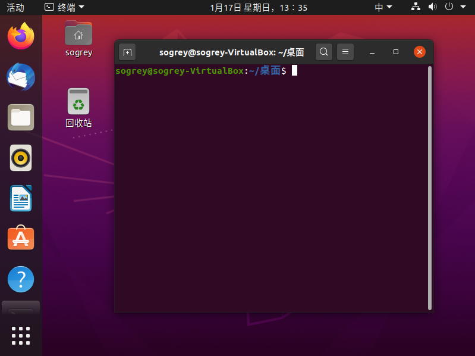

官网：[https://ubuntu.com/](https://ubuntu.com/) [Ubuntu Server](https://ubuntu.com/server)

下载地址：

- [https://ubuntu.com/download](https://ubuntu.com/download)
- [https://ubuntu.com/download/server](https://ubuntu.com/download/server)

### 
CentOS

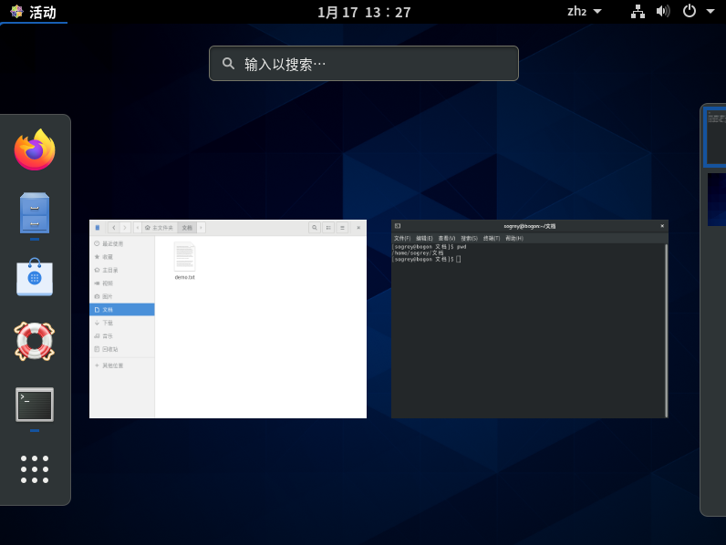

官网：[https://www.centos.org/](https://www.centos.org/)

下载地址：

- [https://wiki.centos.org/Download](https://wiki.centos.org/Download)

### Huawei EulorOS （基于 CentOS）

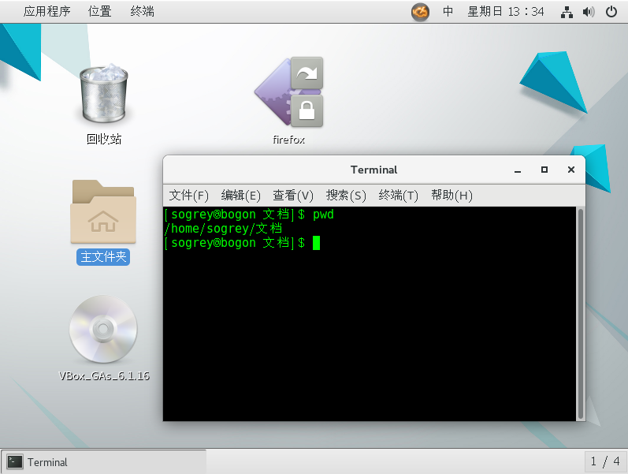

官网：[https://developer.huaweicloud.com/ict/en/site-euleros/euleros](https://developer.huaweicloud.com/ict/en/site-euleros/euleros)

下载地址：

- [https://developer.huaweicloud.com/en-us/euleros/download.html?developlan=Other](https://developer.huaweicloud.com/en-us/euleros/download.html?developlan=Other)

### 
Debian

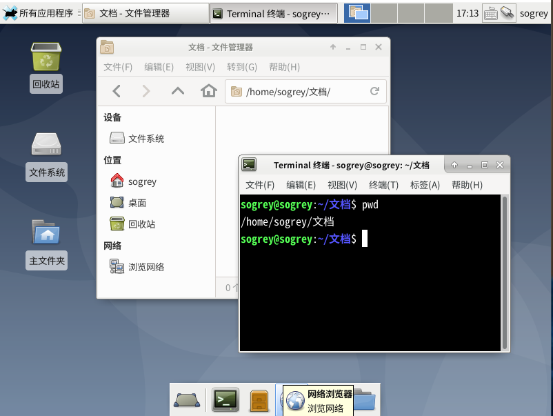

官网：[https://www.debian.org/](https://www.debian.org/)

下载地址：

- [https://www.debian.org/distrib/](https://www.debian.org/distrib/)
- [https://www.debian.org/CD/](https://www.debian.org/CD/)

### 
Deepin

官网：挂了

### 
SUSE
 

官网：[https://www.suse.com/](https://www.suse.com/)

下载地址：

- [https://www.suse.com/download/](https://www.suse.com/download/)

### 
openSUSE

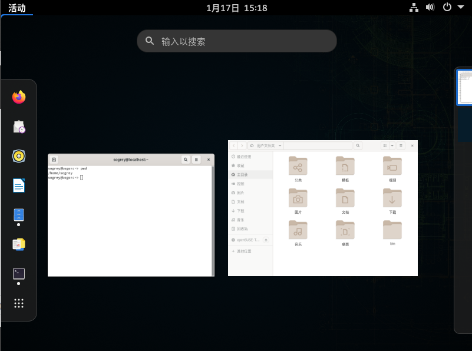

官网：[https://www.opensuse.org/](https://www.opensuse.org/)

下载地址：

- [https://software.opensuse.org/distributions/tumbleweed](https://software.opensuse.org/distributions/tumbleweed)

### 
Fedora

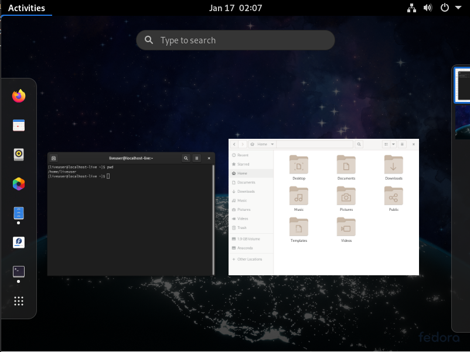

官网：[https://getfedora.org/](https://getfedora.org/)

下载地址：

- [https://getfedora.org/en/workstation/download/](https://getfedora.org/en/workstation/download/)
- [https://getfedora.org/en/server/download/](https://getfedora.org/en/server/download/)
- [[Fedora CoreOS] https://getfedora.org/en/coreos/download](https://getfedora.org/en/coreos/download)

### 
Linux Mint

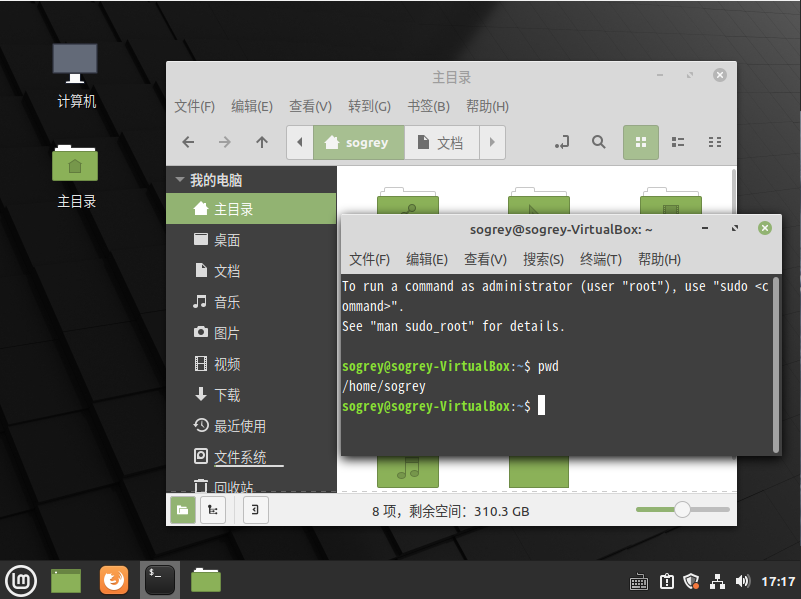

官网：[https://linuxmint.com/](https://linuxmint.com/)

下载地址：

- [https://linuxmint.com/download.php](https://linuxmint.com/download.php)

### 
Alpine Linux

官网：[https://www.alpinelinux.org/](https://www.alpinelinux.org/)

下载地址：

- [https://alpinelinux.org/downloads/](https://alpinelinux.org/downloads/)
- [https://mirrors.alpinelinux.org/](https://mirrors.alpinelinux.org/)

### 
Arch Linux

官网：[https://archlinux.org/](https://archlinux.org/)

下载地址：

- [https://archlinux.org/download/](https://archlinux.org/download/)

### 
FreeBSD

官网：[https://www.freebsd.org/](https://www.freebsd.org/)

下载地址：

- [https://www.freebsd.org/where.html](https://www.freebsd.org/where.html)

### 
MX Linux
 

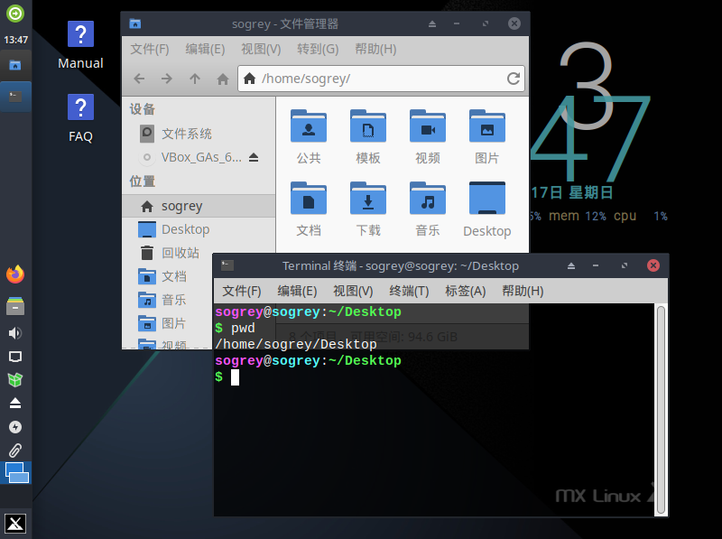

官网：[https://mxlinux.org/](https://mxlinux.org/)

下载地址：
- [http://mirror.umd.edu/mxlinux-iso/MX/Final/](http://mirror.umd.edu/mxlinux-iso/MX/Final/)
- [http://mirror.cogentco.com/pub/linux/mxlinux-iso/MX/Final/](http://mirror.umd.edu/mxlinux-iso/MX/Final/)

### Kali Linux

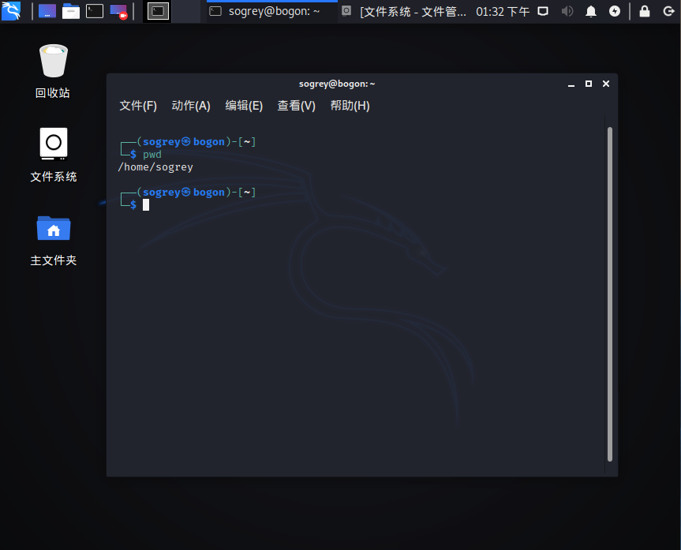

官网：[https://www.kali.org/](https://www.kali.org/)

下载地址：

- [https://www.kali.org/downloads/](https://www.kali.org/downloads/)

### 
Gentoo

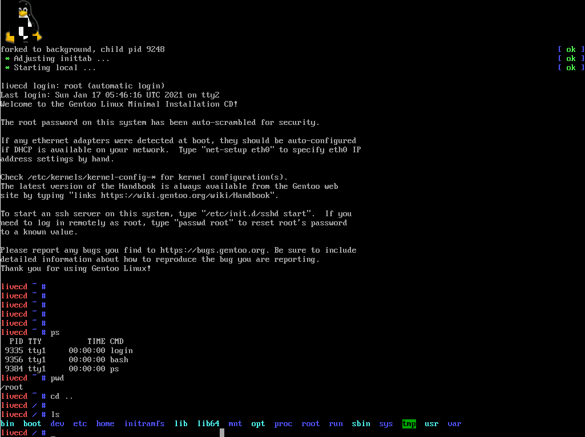

官网：[https://www.gentoo.org/](https://www.gentoo.org/)

下载地址：

- [https://www.gentoo.org/downloads/](https://www.gentoo.org/downloads/)

### Mandriva

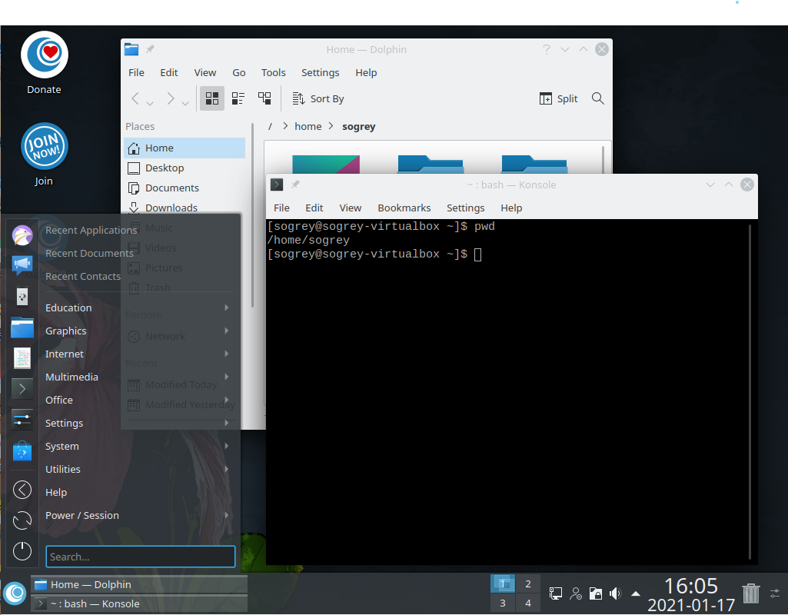

官网：[https://www.openmandriva.org/](https://www.openmandriva.org/)

下载地址：

- [https://www.openmandriva.org/en/download](https://www.openmandriva.org/en/download)

### 
Linux | Oracle
 

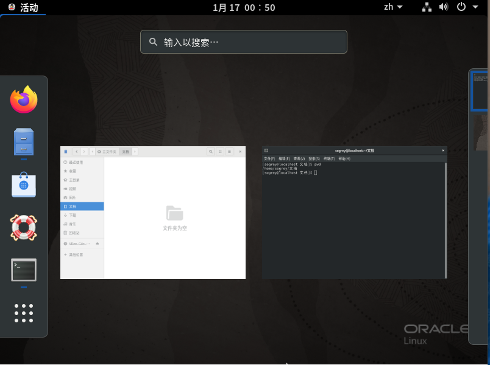

官网：[https://www.oracle.com/linux/](https://www.oracle.com/linux/)

下载地址：

- [https://www.oracle.com/linux/technologies/oracle-linux-downloads.html](https://www.oracle.com/linux/technologies/oracle-linux-downloads.html)

### Turbolinux

官网：[http://www.turbolinux.org/](http://www.turbolinux.org/)

### 优麒麟 UbuntuKylin

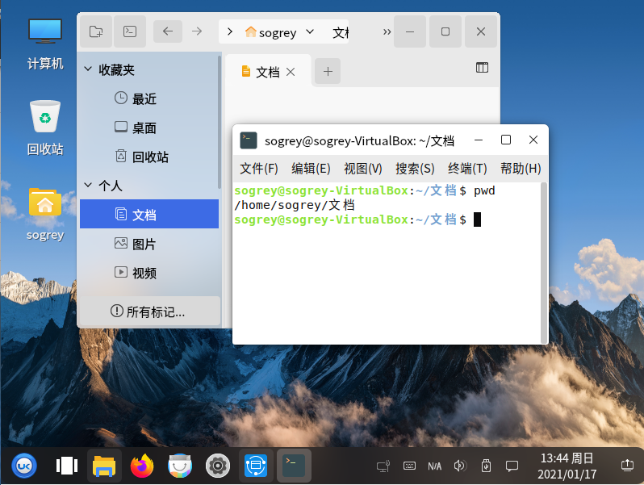

官网：[https://www.ubuntukylin.com/](https://www.ubuntukylin.com/)

下载地址：

- [https://www.ubuntukylin.com/downloads/show.php?id=451&lang=en](https://www.ubuntukylin.com/downloads/show.php?id=451&lang=en)

---

> 欢迎补充。
